# 🤖 Autonomous Research Agent

<div align="center">


*A production-grade autonomous research agent with safety guardrails, comprehensive tool integration, and enterprise observability*

[Quick Start](#-quick-start) • [Architecture](#-architecture) • [Safety](#-safety--security) • [API Reference](#-api-reference) • [Contributing](#-contributing)

</div>

---

## 📋 Table of Contents

1. [Overview](#-overview)
2. [Quick Start](#-quick-start)
3. [Architecture](#-architecture)
4. [Directory Structure Guide](#-directory-structure-guide)
5. [Core Components Deep Dive](#-core-components-deep-dive)
6. [Safety & Security](#-safety--security)
7. [API Reference](#-api-reference)
8. [Configuration](#-configuration)
9. [Development Workflow](#-development-workflow)
10. [Deployment](#-deployment)
11. [Monitoring & Observability](#-monitoring--observability)
12. [Troubleshooting](#-troubleshooting)
13. [Contributing](#-contributing)

---

## 🌟 Overview

The Autonomous Research Agent is an intelligent system that can independently research topics, gather information from multiple sources, and synthesize findings - all while maintaining strict safety controls and comprehensive audit trails.

### Key Capabilities

```mermaid
graph TB
    A[Research Goal] --> B[Agent Planner]
    B --> C{Choose Strategy}
    C -->|Simple Tasks| D[Reactive Planner]
    C -->|Complex Tasks| E[Deliberative Planner]
    D --> F[Tool Selection]
    E --> F
    F --> G[Safety Check]
    G -->|✅ Safe| H[Tool Execution]
    G -->|❌ Blocked| I[Safety Log]
    H --> J[Result Processing]
    J --> K[Memory Storage]
    K --> L{Task Complete?}
    L -->|No| B
    L -->|Yes| M[Final Report]
    
    style A fill:#e1f5fe
    style M fill:#e8f5e8
    style I fill:#ffebee
    style G fill:#fff3e0
```



**What Makes This Special:**
- 🧠 **Intelligent Planning**: Dual planner architecture (reactive vs. deliberative)
- 🛡️ **Safety First**: Comprehensive guardrails and content filtering
- 🔧 **Tool Ecosystem**: Extensible plugin architecture for capabilities
- 📊 **Enterprise Ready**: Full observability, metrics, and audit trails
- 🚀 **Production Grade**: Docker, CI/CD, comprehensive testing

---

## ⚡ Quick Start

### 1-Minute Setup

```bash
# Clone and initialize
git clone <repository-url>
cd autonomous-research-agent
make setup

# Configure (copy and edit)
cp .env.example .env
# Add your OpenAI API key to .env

# Launch the system
make run
```

### Your First Research Task

```bash
# Via CLI
agent run "Find the latest developments in renewable energy storage"

# Via Web UI
open http://localhost:8000

# Via API
curl -X POST http://localhost:8000/api/v1/task \
  -H "Content-Type: application/json" \
  -d '{"goal": "Research quantum computing trends"}'
```

**What happens next?** The agent will:
1. 🎯 Parse your research goal
2. 📋 Create an execution plan
3. 🔍 Search for relevant information
4. 📄 Fetch and process content
5. 🧠 Synthesize findings
6. 📊 Deliver a comprehensive report

---

## 🏗️ Architecture

### System Overview


### Execution Flow

The agent operates on a **Sense-Plan-Act** loop:

```mermaid
sequenceDiagram
    participant User
    participant Agent
    participant Planner
    participant Tools
    participant Memory
    participant Safety
    
    User->>Agent: Submit Research Goal
    Agent->>Memory: Store Initial Task
    
    loop Until Goal Achieved
        Agent->>Planner: Current State + Goal
        Planner->>Planner: Analyze & Plan Next Step
        Planner->>Agent: Action Plan
        Agent->>Safety: Validate Action
        alt Action Safe
            Safety->>Agent: ✅ Approved
            Agent->>Tools: Execute Tool
            Tools->>Agent: Results
            Agent->>Memory: Store Progress
        else Action Blocked
            Safety->>Agent: ❌ Blocked
            Agent->>Memory: Log Safety Block
        end
    end
    
    Agent->>User: Final Report
```



---

## 📁 Directory Structure Guide

Let's explore every file and directory in detail:

### 📂 Root Directory

```
autonomous-research-agent/
├── 📁 .github/          # GitHub workflows and templates
├── 📁 app/              # Core application code
├── 📁 cli/              # Command-line interface
├── 📁 ui/               # React web interface
├── 📁 eval/             # Evaluation framework
├── 📁 tests/            # Test suites
├── 📁 docs/             # Documentation
├── 📁 scripts/          # Utility scripts
├── 📄 pyproject.toml    # Python project configuration
├── 📄 Dockerfile       # Container definition
├── 📄 docker-compose.yml # Multi-service orchestration
├── 📄 Makefile         # Development commands
├── 📄 .env.example     # Configuration template
└── 📄 README.md        # This file
```

### 🔧 Configuration Files

#### `pyproject.toml` - The Project Heart
```toml
# This file defines everything about our Python project:
# - Dependencies (langchain, fastapi, openai, etc.)
# - Development tools (pytest, black, ruff, mypy)
# - Build settings and entry points
# - Code quality configurations
```

**Key sections:**
- **Dependencies**: Production libraries the agent needs
- **Dev Dependencies**: Tools for development and testing
- **Scripts**: CLI entry points (`agent` command)
- **Tool Configs**: Settings for black, ruff, isort, mypy, pytest

#### `.env.example` - Configuration Template
```bash
# Copy this to .env and customize
OPENAI_API_KEY=your_key_here  # Required for LLM
SAFE_MODE=true                # Enable safety guardrails
MAX_STEPS=10                  # Limit agent execution
DEBUG=false                   # Production vs development
```

#### `Makefile` - Developer Commands
```makefile
# Provides convenient commands:
make setup    # Initialize development environment
make run      # Start the application
make test     # Run test suite
make lint     # Code quality checks
make demo     # Run demonstration
```

### 🏛️ Application Core (`app/`)

The `app/` directory contains the heart of our autonomous agent:

```
app/
├── 📄 __init__.py       # Package initialization
├── 📄 main.py           # FastAPI application entry point
├── 📁 api/              # REST API endpoints
├── 📁 core/             # Agent logic and algorithms
├── 📁 tools/            # Tool implementations
├── 📁 llm/              # Language model adapters
└── 📁 utils/            # Utilities and helpers
```

#### `app/main.py` - Application Entry Point
```python
"""
This is where everything starts. It:
1. Creates the FastAPI app
2. Sets up middleware (CORS, logging)
3. Includes API routes
4. Configures observability
5. Serves the React UI in production
"""
```

**Key responsibilities:**
- Application lifecycle management
- Middleware configuration
- Route registration
- Health check endpoints
- Static file serving

### 🧠 Core Logic (`app/core/`)

The brain of our autonomous agent lives here:

```
app/core/
├── 📄 agent.py          # Main agent orchestration
├── 📄 planner.py        # Task planning strategies
├── 📄 memory.py         # Persistent storage
└── 📄 guardrails.py     # Safety mechanisms
```

#### `app/core/agent.py` - The Agent Brain
```python
class ResearchAgent:
    """
    The central orchestrator that:
    - Manages task lifecycle (start, monitor, cancel)
    - Coordinates between planners and tools
    - Ensures safety through guardrails
    - Maintains execution context in memory
    - Handles errors gracefully
    """
```

**Key classes:**
- `ResearchAgent`: Main orchestrator
- `TaskResult`: Complete execution record  
- `AgentStep`: Individual action record
- `TaskStatus`: Execution state tracking

#### `app/core/planner.py` - Strategic Thinking
```python
class Planner:
    """
    Abstract base for planning strategies:
    - ReactiveePlanner: Single-step immediate actions
    - DeliberativePlanner: Multi-step strategic planning
    
    Both parse LLM responses into structured ActionPlan objects
    """
```

**Planning strategies:**
- **Reactive**: Best for simple, direct tasks
- **Deliberative**: Best for complex, multi-step research

#### `app/core/memory.py` - Persistent Storage  
```python
class MemoryStore:
    """
    SQLite-based storage that:
    - Stores complete task execution history
    - Enables task recovery and resumption  
    - Provides audit trails for compliance
    - Supports performance analytics
    """
```

#### `app/core/guardrails.py` - Safety First
```python
class Guardrails:
    """
    Comprehensive safety system:
    - URL allowlist validation
    - Rate limiting per tool
    - Prompt injection detection
    - Content filtering
    - PII redaction in logs
    """
```

### 🛠️ Tool Ecosystem (`app/tools/`)

Our agent's capabilities come from its tools:

```
app/tools/
├── 📄 base.py           # Tool interface definition
├── 📄 registry.py       # Tool discovery and management
├── 📄 web_search.py     # DuckDuckGo search integration
├── 📄 web_fetch.py      # HTML content retrieval
├── 📄 calculator.py     # Safe mathematical operations
├── 📄 file_ops.py       # Sandboxed file operations
└── 📄 sql_query.py      # SQLite query execution
```

#### `app/tools/base.py` - Tool Foundation
```python
class Tool:
    """
    Every tool inherits from this base class:
    - Standardized execute() method
    - Input validation and sanitization  
    - Error handling and logging
    - Result formatting (ToolResult)
    """
```

#### `app/tools/web_search.py` - Information Discovery
```python
class WebSearchTool(Tool):
    """
    DuckDuckGo search integration:
    - Async search execution
    - Result formatting and ranking
    - Rate limiting compliance
    - Error handling for network issues
    """
```

#### `app/tools/web_fetch.py` - Content Retrieval
```python
class WebFetchTool(Tool):
    """
    Web content fetching with safety:
    - HTML to Markdown conversion
    - Content size limits
    - URL allowlist checking (safe mode)
    - Timeout handling
    """
```

#### `app/tools/calculator.py` - Safe Computation
```python
class CalculatorTool(Tool):
    """
    Mathematical operations using AST parsing:
    - No arbitrary code execution
    - Support for basic math functions
    - Scientific operations (sin, cos, sqrt, etc.)
    - Division by zero protection
    """
```

### 🤖 Language Model Interface (`app/llm/`)

```
app/llm/
├── 📄 adapters.py       # LLM provider abstraction
└── 📄 prompts.py        # Prompt templates
```

#### `app/llm/adapters.py` - Provider Abstraction
```python
class LLMAdapter:
    """
    Unified interface supporting:
    - OpenAI GPT models
    - Hugging Face models
    - Anthropic Claude (extensible)
    - Local models (extensible)
    """
```

#### `app/llm/prompts.py` - Conversation Templates  
```python
# Carefully crafted prompts for:
# - Reactive planning (immediate actions)
# - Deliberative planning (strategic thinking)
# - Task completion detection
# - Result summarization
```

### 🌐 API Layer (`app/api/`)

```
app/api/
├── 📄 routes.py         # REST endpoint definitions
└── 📄 models.py         # Pydantic request/response models
```

#### `app/api/routes.py` - HTTP Interface
```python
# RESTful endpoints:
POST /api/v1/task        # Start new research task
GET  /api/v1/status/{id} # Check task progress  
POST /api/v1/cancel/{id} # Cancel running task
GET  /api/v1/health      # System health check
```

### 🧰 Utilities (`app/utils/`)

```
app/utils/
├── 📄 config.py         # Configuration management
├── 📄 security.py       # Security utilities
└── 📄 observability.py  # Logging, metrics, tracing
```

#### `app/utils/config.py` - Settings Management
```python
class Settings(BaseSettings):
    """
    Pydantic-based configuration:
    - Environment variable loading
    - Type validation and conversion
    - Default values and validation
    - Documentation for each setting
    """
```

#### `app/utils/security.py` - Security Toolkit
```python
# Security functions:
def is_url_allowed()     # URL allowlist validation
def redact_pii()         # Personal information scrubbing
def detect_injection()   # Prompt injection detection
def sanitize_input()     # Input cleaning
```

#### `app/utils/observability.py` - System Insights
```python
# Observability setup:
def setup_logging()      # Structured JSON logging
def setup_metrics()      # Prometheus metrics
def setup_tracing()      # OpenTelemetry tracing
```

---

## 💻 Command Line Interface (`cli/`)

```
cli/
├── 📄 __init__.py
└── 📄 client.py         # Rich CLI application
```

#### `cli/client.py` - Interactive Terminal
```python
"""
Beautiful CLI using Typer and Rich:
- agent run "research goal"     # Start task
- agent status <task-id>        # Check progress  
- agent cancel <task-id>        # Cancel task
- Rich progress bars and tables
- Colored output and formatting
"""
```

**Features:**
- Progress indicators during execution
- Formatted result display
- Error handling with helpful messages
- Configurable server endpoints

---

## 🌐 Web Interface (`ui/`)

```
ui/
├── 📄 package.json      # Node.js dependencies
├── 📁 src/              # React application
│   ├── 📄 App.js        # Main application component
│   ├── 📄 index.js      # React entry point
│   └── 📁 components/   # UI components
│       ├── 📄 TaskForm.js    # Task submission form
│       └── 📄 TaskTrace.js   # Execution visualization
└── 📁 public/
    └── 📄 index.html    # HTML template
```

#### React Components Overview
```javascript
// TaskForm.js - Research goal submission
// TaskTrace.js - Real-time execution monitoring
// App.js - Main application layout and routing
```

---

## 🧪 Evaluation Framework (`eval/`)

```
eval/
├── 📄 __init__.py
├── 📄 benchmarks.py     # Synthetic test generation
├── 📄 scoring.py        # Automated evaluation
└── 📁 tasks/            # Specific evaluation scenarios
    ├── 📄 fact_collection.py
    └── 📄 web_research.py
```

#### `eval/benchmarks.py` - Quality Assurance
```python
"""
Automated evaluation system:
- Generate synthetic research tasks
- Compare results against golden answers
- Measure success rates and accuracy
- Performance profiling (speed, tool usage)
"""
```

---

## 🧪 Testing (`tests/`)

```
tests/
├── 📄 conftest.py       # Pytest fixtures and configuration
├── 📄 test_agent.py     # Agent core functionality tests
├── 📄 test_tools.py     # Tool integration tests
├── 📄 test_api.py       # API endpoint tests
└── 📄 test_security.py  # Safety and security tests
```

#### `tests/conftest.py` - Test Infrastructure
```python
"""
Pytest configuration providing:
- Mock LLM responses for consistent testing
- Temporary databases for isolation
- Async test support
- Coverage reporting setup
"""
```

**Test categories:**
- **Unit tests**: Individual component testing
- **Integration tests**: Full workflow testing
- **Security tests**: Safety mechanism validation
- **Performance tests**: Load and stress testing

---

## 📚 Documentation (`docs/`)

```
docs/
├── 📄 README.md         # This comprehensive guide
├── 📄 THREAT_MODEL.md   # Security analysis
├── 📄 SAFETY_GUIDELINES.md # Safety best practices
└── 📁 diagrams/         # Mermaid architecture diagrams
    ├── 📄 agent_loop.mmd
    └── 📄 tool_calls.mmd
```

---

## 🔧 Development Scripts (`scripts/`)

```
scripts/
├── 📄 setup.sh          # Environment initialization
└── 📄 demo.py           # Interactive demonstration
```

#### `scripts/demo.py` - Live Demonstration
```python
"""
Interactive demo showing:
- Basic research task execution
- Individual tool capabilities  
- Error handling scenarios
- Performance characteristics
"""
```

---

## 🐳 Containerization

### `Dockerfile` - Application Container
```dockerfile
# Multi-stage build:
# 1. Install Poetry and dependencies
# 2. Copy application code  
# 3. Set up runtime environment
# 4. Configure entry point
```

### `docker-compose.yml` - Service Orchestration
```yaml
# Complete stack including:
# - app: Main research agent
# - ui: React frontend  
# - jaeger: Distributed tracing
# - prometheus: Metrics collection
```

---

## 🚀 GitHub Actions (`.github/workflows/`)

### `ci.yml` - Continuous Integration
```yaml
# Automated pipeline:
# 1. Code quality checks (lint, format, type)
# 2. Test execution with coverage  
# 3. Security scanning
# 4. Docker image building
# 5. Deployment (if configured)
```

---

## 🛡️ Safety & Security

### Multi-Layer Security Architecture


### Safety Mechanisms

#### 1. **Input Validation**
```python
# Every input is validated:
- URL format checking
- Parameter type validation  
- Content size limits
- Character encoding verification
```

#### 2. **Action Filtering** 
```python
# Before any action execution:
- URL allowlist checking (safe mode)
- Rate limit enforcement
- Prompt injection detection
- Tool capability restrictions
```

#### 3. **Output Sanitization**
```python  
# All outputs are cleaned:
- PII redaction (SSN, emails, phones)
- HTML tag stripping
- Content length limiting
- Encoding normalization
```

#### 4. **Audit Trails**
```python
# Everything is logged:
- Complete execution traces  
- Safety decisions and blocks
- Tool usage and results
- Performance metrics
```

### Configuration for Safety

```bash
# .env safety settings
SAFE_MODE=true              # Enable all safety checks
MAX_STEPS=10                # Limit execution steps
TIMEOUT_SECONDS=300         # Maximum task duration
RATE_LIMIT_REQUESTS=100     # Requests per hour per tool
ALLOWED_DOMAINS=["wikipedia.org", "github.com"]  # URL allowlist
```

---

## 🔌 API Reference

### REST Endpoints

#### Start Research Task
```http
POST /api/v1/task
Content-Type: application/json

{
  "goal": "Research latest developments in quantum computing",
  "planner_type": "deliberative",
  "max_steps": 15
}
```

**Response:**
```json
{
  "task_id": "uuid-here",
  "status": "started"
}
```

#### Check Task Status
```http
GET /api/v1/status/{task_id}
```

**Response:**
```json
{
  "task_id": "uuid-here",
  "goal": "Research quantum computing",
  "status": "completed",
  "result": "Comprehensive research findings...",
  "steps": [...],
  "total_duration_ms": 45000,
  "created_at": "2024-01-15T10:30:00Z",
  "completed_at": "2024-01-15T10:30:45Z"
}
```

#### Cancel Task
```http
POST /api/v1/cancel/{task_id}
```

### Python API

```python
from app.core.agent import ResearchAgent
from app.core.planner import PlannerType

# Initialize agent
agent = ResearchAgent()

# Start task
task_id = await agent.start_task(
    goal="Research renewable energy trends",
    planner_type=PlannerType.DELIBERATIVE
)

# Monitor progress
status = await agent.get_task_status(task_id)
print(f"Status: {status.status}")
print(f"Steps completed: {len(status.steps)}")

# Get final results
if status.status == TaskStatus.COMPLETED:
    print(f"Results: {status.result}")
```

---

## ⚙️ Configuration

### Environment Variables

| Variable | Default | Description |
|----------|---------|-------------|
| `OPENAI_API_KEY` | - | **Required** OpenAI API key |
| `LLM_PROVIDER` | `openai` | LLM provider (openai/huggingface) |
| `MODEL_NAME` | `gpt-4-turbo-preview` | LLM model to use |
| `SAFE_MODE` | `true` | Enable safety guardrails |
| `MAX_STEPS` | `10` | Maximum execution steps |
| `TIMEOUT_SECONDS` | `300` | Task timeout in seconds |
| `DATABASE_URL` | `sqlite:///./agent_memory.db` | Database connection |
| `DEBUG` | `false` | Enable debug logging |
| `LOG_LEVEL` | `INFO` | Logging verbosity |

### Advanced Configuration

#### Rate Limiting
```bash
RATE_LIMIT_REQUESTS=100     # Requests per window
RATE_LIMIT_WINDOW=3600      # Window size in seconds
```

#### File Operations
```bash
SANDBOX_DIR=./sandbox       # Sandboxed directory
MAX_FILE_SIZE=10485760      # 10MB file size limit
```

#### Observability
```bash
ENABLE_METRICS=true         # Prometheus metrics
ENABLE_TRACING=true         # OpenTelemetry tracing  
JAEGER_ENDPOINT=http://localhost:14268/api/traces
```

---

## 👨‍💻 Development Workflow

### Setting Up Development Environment

```bash
# 1. Clone repository
git clone <repository-url>
cd autonomous-research-agent

# 2. Install dependencies
make setup

# 3. Configure environment  
cp .env.example .env
# Edit .env with your settings

# 4. Run tests
make test

# 5. Start development server
make run
```

### Code Quality Standards

Our codebase maintains high quality through:

#### Linting and Formatting
```bash
make lint      # Check code quality
make format    # Auto-format code
```

**Tools used:**
- **Ruff**: Fast Python linter
- **Black**: Code formatting
- **isort**: Import sorting
- **mypy**: Type checking

#### Pre-commit Hooks
```bash
# Installed automatically with make setup
pre-commit install

# Manual run
pre-commit run --all-files
```

#### Testing Strategy
```bash
# Run all tests
make test

# Run specific test categories
pytest tests/test_agent.py -v
pytest tests/test_security.py -v

# Run with coverage
pytest --cov=app --cov-report=html
```

### Adding New Tools

1. **Create tool class** in `app/tools/`:
```python
class MyCustomTool(Tool):
    def __init__(self):
        super().__init__(
            name="my_tool",
            description="What this tool does"
        )
    
    async def execute(self, **kwargs) -> ToolResult:
        # Implementation here
        pass
```

2. **Register tool** in `app/tools/registry.py`:
```python
def get_available_tools():
    return {
        "my_tool": MyCustomTool(),
        # ... other tools
    }
```

3. **Add tests** in `tests/test_tools.py`:
```python
@pytest.mark.asyncio
async def test_my_custom_tool():
    tool = MyCustomTool()
    result = await tool.execute(param="value")
    assert result.success
```

### Adding New LLM Providers

1. **Implement adapter** in `app/llm/adapters.py`:
```python
class MyLLMAdapter(LLMAdapter):
    async def generate(self, prompt: str) -> str:
        # Provider-specific implementation
        pass
```

2. **Update factory** in same file:
```python
def get_llm_adapter():
    provider = settings.LLM_PROVIDER
    if provider == "my_provider":
        return MyLLMAdapter()
    # ... other providers
```

---

## 🚢 Deployment

### Docker Deployment

#### Single Container
```bash
# Build image
make docker-build

# Run container
docker run -d \
  --name research-agent \
  -p 8000:8000 \
  --env-file .env \
  autonomous-research-agent:latest
```

#### Full Stack with Docker Compose
```bash
# Start all services
make docker-run

# Services available:
# - App: http://localhost:8000
# - UI: http://localhost:3000  
# - Jaeger: http://localhost:16686
# - Prometheus: http://localhost:9090
```

### Production Considerations

#### Environment Setup
```bash
# Production environment variables
DEBUG=false
LOG_LEVEL=WARNING  
SAFE_MODE=true
ENABLE_METRICS=true
ENABLE_TRACING=true
```

#### Resource Requirements
- **Memory**: 2GB minimum, 4GB recommended
- **CPU**: 2 cores minimum, 4 cores recommended  
- **Storage**: 10GB for logs and database
- **Network**: Outbound HTTPS for LLM APIs

#### Security Checklist
- [ ] API keys in environment variables (not code)
- [ ] Safe mode enabled in production
- [ ] URL allowlist configured appropriately  
- [ ] Rate limiting configured
- [ ] Log rotation configured
- [ ] Regular security updates applied

### Kubernetes Deployment

```yaml
# k8s-deployment.yaml
apiVersion: apps/v1
kind: Deployment
metadata:
  name: research-agent
spec:
  replicas: 3
  selector:
    matchLabels:
      app: research-agent
  template:
    metadata:
      labels:
        app: research-agent
    spec:
      containers:
      - name: research-agent
        image: autonomous-research-agent:latest
        ports:
        - containerPort: 8000
        env:
        - name: OPENAI_API_KEY
          valueFrom:
            secretKeyRef:
              name: llm-secrets
              key: openai-key
```

---

## 📊 Monitoring & Observability

### Logging Strategy

#### Structured Logging
```python
# All logs are JSON structured
{
  "timestamp": "2024-01-15T10:30:00Z",
  "level": "INFO", 
  "logger": "app.core.agent",
  "message": "Task started",
  "task_id": "uuid-here",
  "goal": "Research topic",
  "trace_id": "trace-uuid"
}
```

#### Log Levels
- **DEBUG**: Detailed execution traces
- **INFO**: Normal operation events  
- **WARNING**: Recoverable issues
- **ERROR**: System errors
- **CRITICAL**: System failures

### Metrics Collection

#### Prometheus Metrics
```python
# Key metrics tracked:
agent_tasks_total{status="completed"}      # Task success rate
agent_task_duration_seconds               # Execution time
agent_tool_calls_total{tool="web_search"}  # Tool usage
agent_active_tasks                        # Current load
```

#### Grafana Dashboard

```yaml
# Example dashboard queries:
- Task Success Rate: rate(agent_tasks_total{status="completed"}[5m])
- Average Execution Time: avg(agent_task_duration_seconds)  
- Tool Usage Distribution: sum by (tool)(agent_tool_calls_total)
- Active Tasks: agent_active_tasks
```

### Distributed Tracing

#### OpenTelemetry Integration
```python
# Each request gets a trace with spans for:
- Task execution
- LLM calls
- Tool executions  
- Database operations
```

#### Trace Analysis
- **Jaeger UI**: http://localhost:16686
- **Trace correlation**: Link logs, metrics, and traces
- **Performance bottlenecks**: Identify slow components
- **Error propagation**: Track failures across services

### Health Monitoring

#### Health Check Endpoints
```bash
# Application health
GET /health
# Response: {"status": "healthy", "version": "0.1.0"}

# Detailed system status  
GET /api/v1/health
# Response: {"status": "healthy", "active_tasks": 3, "db_connected": true}
```

#### Alerting Rules
```yaml
# Prometheus alerting examples:
groups:
- name: research-agent
  rules:
  - alert: HighErrorRate
    expr: rate(agent_tasks_total{status="failed"}[5m]) > 0.1
    annotations:
      summary: "High task failure rate detected"
  
  - alert: LongExecutionTime
    expr: histogram_quantile(0.95, agent_task_duration_seconds) > 600
    annotations:
      summary: "Tasks taking too long to complete"
```

---

## 🐛 Troubleshooting

### Common Issues and Solutions

#### 1. **Agent Won't Start**

**Symptoms:**
```bash
ERROR: Failed to start research agent
ConnectionError: Could not connect to LLM provider
```

**Solutions:**
```bash
# Check API key configuration
cat .env | grep OPENAI_API_KEY

# Verify network connectivity
curl -I https://api.openai.com

# Check logs for detailed error
docker logs research-agent

# Test with minimal configuration
OPENAI_API_KEY=your_key make demo
```

#### 2. **Tasks Timing Out**

**Symptoms:**
```bash
Task status: failed
Error: Task execution timeout after 300 seconds
```

**Solutions:**
```bash
# Increase timeout in .env
TIMEOUT_SECONDS=600

# Check for network issues
ping 8.8.8.8

# Review tool performance
curl http://localhost:8000/metrics | grep tool_duration

# Enable debug logging
LOG_LEVEL=DEBUG make run
```

#### 3. **Tools Being Blocked**

**Symptoms:**
```bash
Step 1: Action blocked by safety guardrails
Tool: web_fetch blocked for domain: example.com
```

**Solutions:**
```bash
# Add domain to allowlist in .env
ALLOWED_DOMAINS=["wikipedia.org", "github.com", "example.com"]

# Temporarily disable safe mode (development only)
SAFE_MODE=false

# Check URL formatting
curl -v https://example.com

# Review security logs
docker logs research-agent | grep "safety"
```

#### 4. **Database Issues**

**Symptoms:**
```bash
ERROR: SQLite database is locked
OperationalError: database is locked
```

**Solutions:**
```bash
# Check file permissions
ls -la agent_memory.db

# Kill any hanging processes
pkill -f "autonomous-research-agent"

# Reset database (development only)
rm agent_memory.db && make run

# Use WAL mode for better concurrency
echo "PRAGMA journal_mode=WAL;" | sqlite3 agent_memory.db
```

#### 5. **Memory Issues**

**Symptoms:**
```bash
MemoryError: Unable to allocate array
Task killed due to memory constraints
```

**Solutions:**
```bash
# Monitor memory usage
docker stats research-agent

# Reduce max steps
MAX_STEPS=5

# Increase container memory
docker run -m 4g autonomous-research-agent

# Check for memory leaks
python -m pytest tests/ --memory-profiler
```

### Debug Mode

#### Enable Detailed Logging
```bash
# In .env file
DEBUG=true
LOG_LEVEL=DEBUG

# Run with verbose output
make run 2>&1 | tee debug.log
```

#### Interactive Debugging
```python
# Add breakpoints in code
import pdb; pdb.set_trace()

# Or use rich debugging
from rich.traceback import install
install(show_locals=True)
```

#### Tool-Specific Debugging
```bash
# Test individual tools
python -c "
import asyncio
from app.tools.web_search import WebSearchTool

async def test():
    tool = WebSearchTool()
    result = await tool.execute(query='test')
    print(result)

asyncio.run(test())
"
```

### Performance Optimization

#### Database Optimization
```sql
-- Add indexes for common queries
CREATE INDEX idx_task_status ON tasks(status);
CREATE INDEX idx_task_created ON tasks(created_at);

-- Vacuum database periodically  
VACUUM;

-- Check database size
.schema
.tables
```

#### Memory Optimization
```python
# Monitor object creation
import tracemalloc
tracemalloc.start()

# Profile memory usage
python -m memory_profiler app/main.py
```

#### Network Optimization
```bash
# Enable connection pooling
pip install aiohttp[speedups]

# Configure DNS caching
echo "nameserver 8.8.8.8" >> /etc/resolv.conf

# Monitor network calls
tcpdump -i any port 443
```

---

## 🤝 Contributing

We welcome contributions! Here's how to get involved:

### Development Process

#### 1. **Fork and Clone**
```bash
# Fork on GitHub, then clone
git clone https://github.com/yourusername/autonomous-research-agent.git
cd autonomous-research-agent
```

#### 2. **Create Feature Branch**
```bash
git checkout -b feature/amazing-new-tool
```

#### 3. **Set Up Development Environment**
```bash
make setup
pre-commit install
```

#### 4. **Make Changes**
```bash
# Follow our coding standards
make lint      # Check code quality
make test      # Run tests
make format    # Auto-format code
```

#### 5. **Submit Pull Request**
```bash
git add .
git commit -m "feat: add amazing new tool"
git push origin feature/amazing-new-tool
# Create PR on GitHub
```

### Coding Standards

#### Code Style
```python
# We use Black formatting with these settings:
line-length = 88
target-version = ['py311']

# Type hints are required
def process_data(items: List[str]) -> Dict[str, int]:
    """Process items and return counts."""
    pass

# Docstrings for all public functions
def public_function(param: str) -> str:
    """
    Brief description of what this function does.
    
    Args:
        param: Description of parameter
        
    Returns:
        Description of return value
        
    Raises:
        ValueError: When param is invalid
    """
    pass
```

#### Testing Requirements
```python
# Every feature needs tests
@pytest.mark.asyncio
async def test_new_feature():
    """Test the new feature works correctly."""
    # Arrange
    setup_test_data()
    
    # Act  
    result = await call_feature()
    
    # Assert
    assert result.success
    assert result.data == expected_data

# Aim for >85% code coverage
pytest --cov=app --cov-fail-under=85
```

#### Documentation
```python
# Update relevant documentation
# - Add docstrings to new functions
# - Update README.md if needed
# - Add examples for new features
# - Update API documentation
```

### Contribution Types

#### 🐛 **Bug Fixes**
- Fix broken functionality
- Improve error handling
- Security vulnerability patches

#### ✨ **New Features**
- Additional tools (APIs, databases, etc.)
- New planning strategies
- UI improvements
- Performance optimizations

#### 📚 **Documentation**
- Code examples
- Tutorial improvements  
- API documentation
- Architecture diagrams

#### 🧪 **Testing**
- Additional test cases
- Performance benchmarks
- Security tests
- Integration tests

#### 🔧 **Infrastructure**
- CI/CD improvements
- Docker optimizations
- Monitoring enhancements
- Deployment automation

### Review Process

#### What We Look For
- [ ] **Functionality**: Does it work as intended?
- [ ] **Tests**: Are there adequate tests?
- [ ] **Documentation**: Is it well documented?
- [ ] **Security**: Any security implications?
- [ ] **Performance**: Impact on system performance?
- [ ] **Compatibility**: Backward compatibility maintained?

#### Getting Reviews
1. **Self-review**: Check your own code first
2. **Automated checks**: Ensure CI passes
3. **Description**: Clear PR description with examples
4. **Responsiveness**: Address feedback promptly

---

## 📖 Educational Resources

### Learning Path

#### 1. **Understanding Autonomous Agents**


**Recommended Reading:**
- [LangChain Documentation](https://python.langchain.com/)
- [OpenAI API Guide](https://platform.openai.com/docs)
- [Agent Architecture Patterns](https://arxiv.org/abs/2308.11432)

#### 2. **Code Walkthrough**

**Start Here:**
1. `app/main.py` - Understand the application entry point
2. `app/core/agent.py` - See how the agent orchestrates everything
3. `app/tools/web_search.py` - Learn tool implementation
4. `tests/test_agent.py` - Understand testing approach

**Deep Dive:**
1. `app/core/planner.py` - Planning strategies
2. `app/utils/security.py` - Safety mechanisms  
3. `app/utils/observability.py` - Monitoring setup
4. `eval/benchmarks.py` - Evaluation framework

#### 3. **Architecture Patterns**

**Sense-Plan-Act Loop:**
```python
# This is the core pattern our agent follows
async def agent_loop(goal: str):
    while not task_complete:
        # SENSE: Gather current state
        current_state = await sense_environment()
        
        # PLAN: Decide next action  
        action = await plan_next_step(goal, current_state)
        
        # ACT: Execute planned action
        result = await execute_action(action)
        
        # UPDATE: Store results and continue
        await update_memory(result)
```

**Tool Abstraction Pattern:**
```python
# All tools follow this interface
class Tool(ABC):
    @abstractmethod
    async def execute(self, **kwargs) -> ToolResult:
        """Execute tool with given parameters."""
        pass

# Makes it easy to add new capabilities
class MyNewTool(Tool):
    async def execute(self, **kwargs) -> ToolResult:
        # Your implementation here
        pass
```

### Best Practices

#### 1. **Safety First**
```python
# Always validate inputs
def validate_url(url: str) -> bool:
    if not url.startswith(('http://', 'https://')):
        return False
    if is_blocked_domain(url):
        return False
    return True

# Sanitize outputs
def sanitize_response(text: str) -> str:
    text = remove_pii(text)
    text = strip_html_tags(text)
    return text[:MAX_LENGTH]
```

#### 2. **Error Handling**
```python
# Graceful degradation
try:
    result = await risky_operation()
except SpecificException as e:
    logger.warning("Operation failed, using fallback", error=str(e))
    result = fallback_operation()
except Exception as e:
    logger.error("Unexpected error", error=str(e))
    result = ToolResult(success=False, error=str(e))
```

#### 3. **Observability**
```python
# Structured logging
logger.info(
    "Tool executed successfully",
    tool_name="web_search",
    query="AI research",
    result_count=10,
    duration_ms=1500
)

# Metrics collection
tool_calls_counter.labels(tool_name="web_search", status="success").inc()
tool_duration_histogram.observe(1.5)
```

#### 4. **Testing**
```python
# Test real functionality, not implementation details
@pytest.mark.asyncio  
async def test_research_task_completion():
    """Test that agent can complete a research task end-to-end."""
    agent = ResearchAgent()
    
    # Use real goal, mock external dependencies
    with patch('app.tools.web_search.DDGS') as mock_search:
        mock_search.return_value.text.return_value = mock_search_results
        
        task_id = await agent.start_task("Find Python tutorials")
        # Wait for completion...
        result = await agent.get_task_status(task_id)
        
        assert result.status == TaskStatus.COMPLETED
        assert "Python" in result.result
```

---

## 📈 Roadmap

### Current Version (v0.1.0)
- ✅ Core agent with sense-plan-act loop
- ✅ Dual planner architecture  
- ✅ Basic tool ecosystem
- ✅ Safety guardrails
- ✅ REST API and CLI
- ✅ Comprehensive testing
- ✅ Docker deployment

### Next Release (v0.2.0)
- 🔄 **Enhanced Tools**
  - PDF document processing
  - Database query interface  
  - Code execution sandbox
  - Image analysis capabilities

- 🔄 **Improved Planning**
  - Multi-agent collaboration
  - Dynamic strategy selection
  - Memory-based learning
  - Goal decomposition

- 🔄 **Better UX**
  - Real-time UI updates
  - Task templates
  - Result export formats
  - Mobile-responsive design

### Future Versions (v0.3.0+)
- 🚀 **Advanced Features**
  - Custom tool marketplace
  - Workflow automation
  - Integration APIs (Slack, Discord)
  - Multi-modal capabilities

- 🚀 **Enterprise Features**  
  - Role-based access control
  - Multi-tenant architecture
  - Advanced analytics
  - Custom model training

---

## 🎯 Use Cases

### Research and Analysis

#### Academic Research
```python
# Example: Literature review
goal = """
Conduct a comprehensive literature review on 'Large Language Models in Education' 
from 2023-2024. Find key papers, summarize main findings, and identify research gaps.
"""

task_id = await agent.start_task(goal, PlannerType.DELIBERATIVE)
```

#### Market Research
```python
# Example: Competitive analysis
goal = """
Research the top 5 CRM software companies, compare their features, pricing, 
and recent developments. Create a competitive landscape analysis.
"""
```

#### Technical Investigation
```python
# Example: Technology assessment
goal = """
Investigate the current state of quantum computing hardware, focusing on 
IBM, Google, and IonQ platforms. Compare qubit counts, error rates, and 
recent breakthroughs.
"""
```

### Business Intelligence

#### Trend Analysis
```python
# Example: Industry trends
goal = """
Analyze current trends in renewable energy investment, focusing on solar 
and wind sectors. Include recent policy changes and market forecasts.
"""
```

#### Due Diligence
```python
# Example: Company research
goal = """
Research TechCorp Inc: financial performance, key executives, recent news, 
competitive position, and growth prospects. Focus on 2023-2024 period.
"""
```

### Personal Assistance

#### Travel Planning
```python
# Example: Trip research
goal = """
Plan a 7-day itinerary for Tokyo, Japan. Include must-visit attractions, 
local restaurants, transportation options, and cultural etiquette tips.
"""
```

#### Learning Support
```python
# Example: Educational research
goal = """
Create a comprehensive study guide for machine learning fundamentals, 
including key concepts, recommended resources, and practice problems.
"""
```

---

## ⚖️ License

This project is licensed under the MIT License - see the [LICENSE](LICENSE) file for details.

```
MIT License

Copyright (c) 2024 Autonomous Research Agent Contributors

Permission is hereby granted, free of charge, to any person obtaining a copy
of this software and associated documentation files (the "Software"), to deal
in the Software without restriction, including without limitation the rights
to use, copy, modify, merge, publish, distribute, sublicense, and/or sell
copies of the Software, and to permit persons to whom the Software is
furnished to do so, subject to the following conditions:

The above copyright notice and this permission notice shall be included in all
copies or substantial portions of the Software.

THE SOFTWARE IS PROVIDED "AS IS", WITHOUT WARRANTY OF ANY KIND, EXPRESS OR
IMPLIED, INCLUDING BUT NOT LIMITED TO THE WARRANTIES OF MERCHANTABILITY,
FITNESS FOR A PARTICULAR PURPOSE AND NONINFRINGEMENT. IN NO EVENT SHALL THE
AUTHORS OR COPYRIGHT HOLDERS BE LIABLE FOR ANY CLAIM, DAMAGES OR OTHER
LIABILITY, WHETHER IN AN ACTION OF CONTRACT, TORT OR OTHERWISE, ARISING FROM,
OUT OF OR IN CONNECTION WITH THE SOFTWARE OR THE USE OR OTHER DEALINGS IN THE
SOFTWARE.
```

---

## 🙏 Acknowledgments

### Technologies Used
- **[FastAPI](https://fastapi.tiangolo.com/)** - Modern, fast web framework
- **[LangChain](https://python.langchain.com/)** - LLM application framework  
- **[OpenAI](https://openai.com/)** - GPT models and API
- **[Pydantic](https://pydantic-docs.helpmanual.io/)** - Data validation
- **[SQLAlchemy](https://www.sqlalchemy.org/)** - Database ORM
- **[pytest](https://pytest.org/)** - Testing framework
- **[Docker](https://www.docker.com/)** - Containerization
- **[Prometheus](https://prometheus.io/)** - Metrics and monitoring

### Inspiration
This project draws inspiration from:
- [AutoGPT](https://github.com/Significant-Gravitas/AutoGPT) - Pioneering autonomous AI
- [LangChain Agents](https://python.langchain.com/docs/modules/agents/) - Agent frameworks
- [OpenAI Function Calling](https://platform.openai.com/docs/guides/function-calling) - Tool integration patterns

### Community
Special thanks to the open-source community for providing the foundational tools and libraries that make this project possible.

---

## 📞 Support

### Getting Help

#### 1. **Documentation**
- Check this README for comprehensive information
- Review code comments and docstrings
- Look at test cases for usage examples

#### 2. **Community**
- **GitHub Issues**: Report bugs and request features
- **Discussions**: Ask questions and share ideas
- **Discord**: Real-time community support (if available)

#### 3. **Commercial Support**
For enterprise deployments and custom development:
- Professional services available
- Custom tool development
- Training and consultation

### Reporting Issues

#### Bug Reports
```markdown
**Bug Description**
Clear description of the issue

**Steps to Reproduce**
1. Run command X
2. Observe behavior Y
3. Expected behavior Z

**Environment**
- OS: Ubuntu 20.04
- Python: 3.11.5
- Version: v0.1.0

**Logs**
```
Include relevant log output
```
